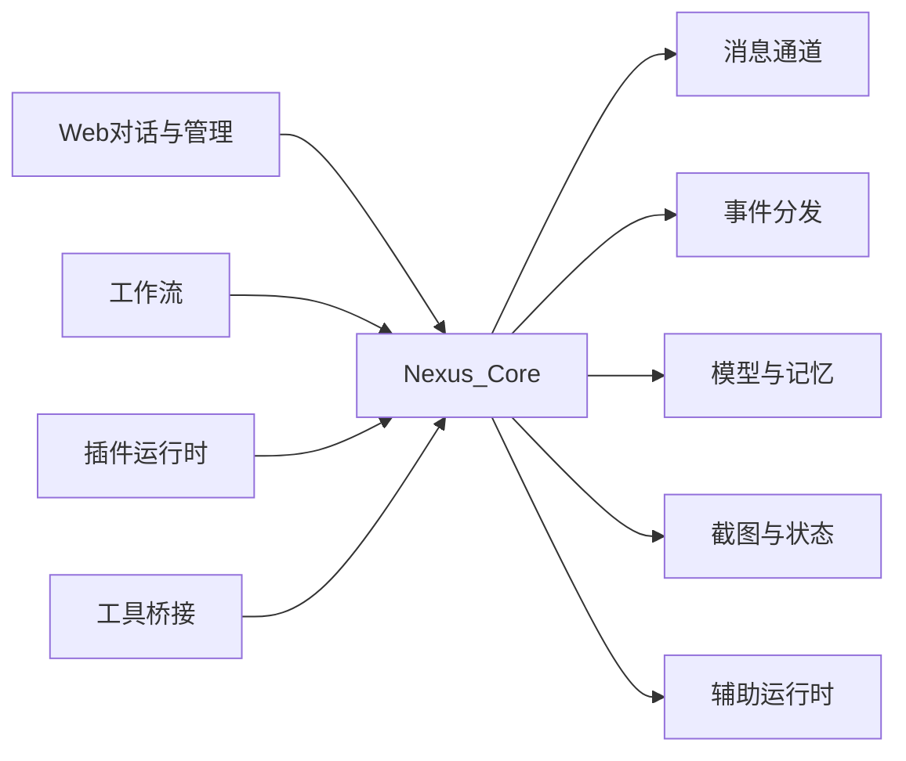

# 能力鱼骨图

```text
                         ┌─ Web 控制台与框架内对话
                         ├─ 管理端（账号 / 密码）
        控制面 ──────────┼─ 工作流引擎
                         ├─ 插件运行时（热重载）
                         └─ 工具桥接 / MCP
                                    │
  【产品】AI 对话与自动化枢纽 ══════╪════ Nexus Core
                                    │
                         ┌─ 消息通道适配（Web / Webhook / OneBot）
                         ├─ 事件与任务分发
        数据面 ──────────┼─ 模型路由与会话记忆
                         ├─ 状态图 / 菜单截图
                         └─ 辅助运行时（并发 / 本地自动化）
```



扩展面对照（灵感来自通用后端分层思路）：插件、工作流、通道 adapter、HTTP、事件、渲染、配置——放对目录即可挂上。
