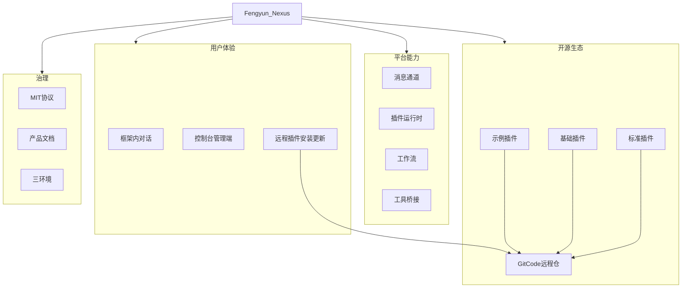

# Fengyun Nexus · 产品规划总图

独立产品脊骨：用户体验、平台能力、开源生态、治理四翼。

```text
                         ┌─ 框架内对话
           用户体验 ─────┼─ 控制台 / 管理端
                         └─ 远程插件安装与更新
                                    │
                         ┌─ 消息通道
           平台能力 ─────┼─ 插件运行时
                         ├─ 工作流
                         └─ 工具桥接
                                    │
  Fengyun Nexus ════════════════════╪════ product brand (English)
                                    │
                         ┌─ 示例插件
           开源生态 ─────┼─ 基础插件  ──► GitCode 远程仓
                         └─ 标准插件
                                    │
                         ┌─ MIT 开源协议
             治理 ───────┼─ 产品文档与架构图
                         └─ 三环境：手机 / 电脑 / 服务器
```


